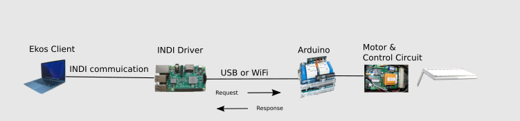
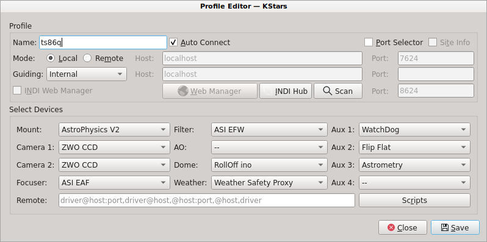
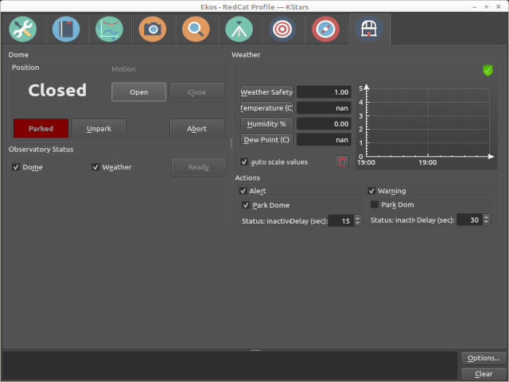
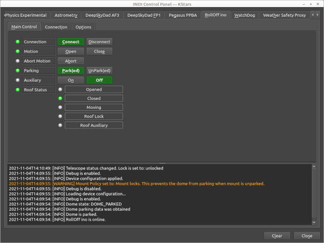
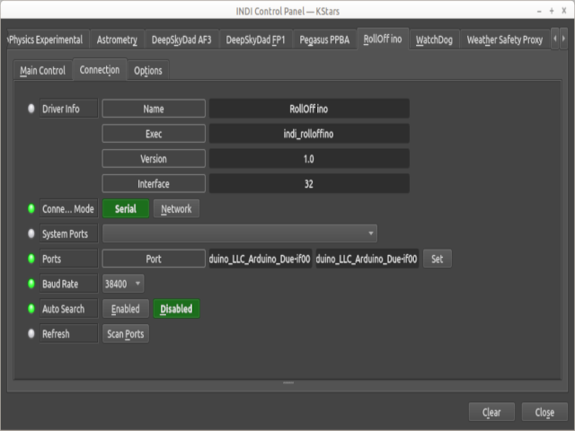
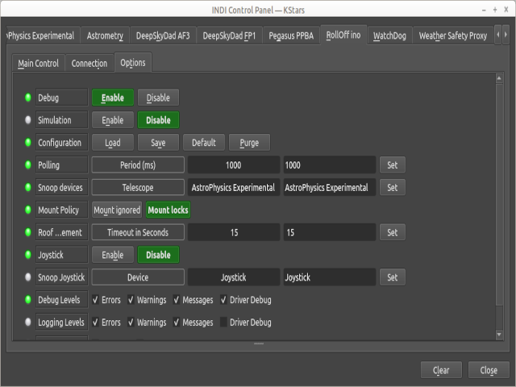
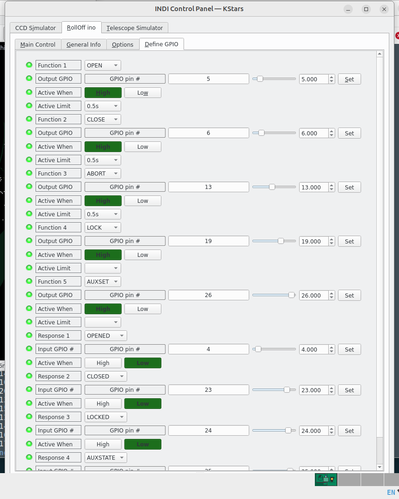

# An INDI Roll Off Roof Driver



The driver as with other INDI drivers can be on the same host as the Ekos client or remote on a different computer located in the observatory. [ Edit to remove WiFi and the Arduino ] 

# The driver

When installed, the RollOff ino driver will be available for selection under Domes in the Ekos profile definition editor.



The driver is derived from the Ekos roll-off roof simulator driver. The driver does not use a USB connection, instead it uese the Raspberry Pi's GPIO pins. The driver responds to Park and Unpark commands from the Ekos Observatory panel. These result in GPIO pin activations intended to operate relays connected to the roof controller.
The driver will generate requests to obtain the state of fully open and fully closed sensors attached to the roof to determine when the park or unpark request have been completed. There is also an Abort request which should stop any movement in progress. A lock status intended to indicate some form of external mechanical roof lock has been applied. If the lock switch is closed it will block the driver from issuing movement requests. There is an Auxiliary function and status. The use of this auxiliary function is undefined in the driver, if and how it is used is left open.

## Observatory interface.
The observatory interface will be the normal way to park and unpark the roof.




## INDI control panels.
The INDI Control panels provide the detail and setup interfaces.

### The Main Panel
The main panel's periodic monitoring of the roof status is reflected in the status lights. The Park/Unpark provides local replication of the Observatory functions. The Open/Close buttons might be of use, if for some reason there is a discrepancy between the drivers notion of where the roof is versus the actual position.



### The Connection Panel
The connection panel is where driver options can be spedified.



### The Options Panel
The options panel is for the setting of the standard driver INDI options and for specifying roof's view of interactions with the telescope mount.



## Weather protection.
The driver will interact with the Ekos weather monitoring applications or DIY local sensors and the watchdog timer along with the other dome related drivers.

## Notes on using a Raspberry Pi to directly interface to a roof controller
Using a commercial controller simplifies the design. A controller can provide proper sizing of the motor for the size and weight of the roof. Provide obstruction protection, enforce range limits, variable force adjustments, slow start and slow stop to lessen the impact of sudden activation to get the roof moving. Some models will run off solar power and the choice of chain or track. With a controller that can be activated by a single or a pair of on/off button it is a simple job to wire a relay in parallel to emulate the pushing of a button. There is built in support in the example relay code to temporarily close a relay for a particular length of time. Such controllers have their own way of detecting the end of roof travel in order to stop movement. Additional switches are required to notify when the roof is fully opened or fully closed.

The Arduino approach uses a single purpose controller to provide flexibility of custom programming. An Arduino Will run for months without maintenance requirement, provides auto startup after power failure and flexible placement. It does require code definition changes if the pin assignments differ from the defaults provided. There is also the need to learn how to build and test using the Arduino IDE.

The purpose of the Raspberry Pi version of the roof driver is to eliminate the use of an Arduino in those situations where the Arduino is in turn using an external controller. There will be a user interface for making the pin assignments and avoid the need to customise any code. This note outlines the prerequisites and limitations along with what was learned using gpio pins during testing.

The implementation depends upon the use of the Raspberry Pi's pigpio library which is only available on Raspberry Pi systems. Building the roof driver using Raspberry Pi GPIO pins is intended for simple direct relay activation of an external controller. The external garage or gate opener controller is responsible for the safe operation of the roof. This includes ensuring it stops when at the end of its travel. The Fully open and fully closed switches are only used to inform the driver when the roof has stopped moving.

If the roof driver is running on a Raspberry Pi it will make direct wired connections from the GPIO pins to a roof controller. There might be other INDI drivers running on the same Raspberry Pi. There is no USB or internet connection to an external device for the roof driver. Instead the usual connection button establishes a connection with the pigpiod GPIO software service. Connecting the driver will make a 'Define GPIO' user interface tab available. The Define GPIO tab is used to setup which GPIO pins to use to interface with the external roof controller. There is no error checking on these assignments at the time of definition. The GPIO value numbers must be correct and match what is actually wired. The output commands Open and Close must be defined. Abort, Lock and Aux are optional. The input switches Fully-opened, Fully-closed must be defined. Locked and Aux-response are optional. For the definitions to be retained, the Options tab "Save" button must be used. The definitions are read and checked when the driver first connects. This means after saving any changes the driver should be reconnected. Once the definitions have been made and are working, the Define GPIO tab will not normally be used. Roof control is performed as before using the Observatory and other normal Ekos roof interactions like responding to weather alerts.



Define the GPIO pin to use for each output function. The output pin is expected to be connected to a relay that will act upon the roof. Indicate whether the relay will be activated by a high or low level applied to the pin. The Active Limit setting is for a transitory activation to be applied to act like a push button. Active Limit specifies how long to hold the relay closed. This is the normal mode to use for Open, Close and Abort. It is used to wire the normally open contacts of the connected output relay to the push button input control of a garage or gate controller.  Lock and Aux might retain the activation until turned off by selecting the No Limit option. If no limiting activation value is entered the relay will be left closed. If the relay is for Lock or Aux it can be released with use of the unlock and Aux off in the main tab. Any default internal pullup or pulldown resistor definitions will be removed for the output pins.

There is no 'until complete' options offered. Meaning keep relay closed until an open or close operation completes. Also the No Limit selection will not be accepted for Open, Close and Abort. The driver does not provide a means to stop the roof when the end of travel is reached. This limits the driver to indirectly controlling a commercial garage or sliding gate controller. Such controllers detect when open and close movement has reached it limits. The various kind of motors and devices to directly control them is not provided for in a general purpose way by the simple definition of GPIO pins. The Arduino configuration variant can be custom programmed to support specific needs. 

For the input pins, select which GPIO pins read the input switches and whether a high or low signal indicates switch closure. There needs to be appropriate pull up or pull down resistors for the active high/low setting selected.  The driver will select the complementary pull up/down Raspberry Pi internal resistor to work with the selection. 

The GPIO Define interface will define and assign the GPIO pins but the assignments need care. To assist, the roof driver will take any GPIO pin defined for input or output use and modify the pin MODE to match.  In a similar way any input pin defined to be active low will get an internal pullup resistor defined to match. The reverse for pins defined as active high. Output pins will have any pullup or pulldown definitions cleared. Any Pins not defined are not cleared, they will retain any mode or pullup pulldown settings previously assigned until the Raspberry Pi is rebooted. The defined and saved settings will be re-applied each time the driver is connected.

Here is what was used for testing on a RPi3-B and RPi4-B. GPIO (BME270) numbers are not the same as the board pin number. They need to be mapped for each Pi model. GPIO numbers are what the roof driver uses. Some GPIO pins have optional or particular assignments. Only the Raspberry 3B and 4B 40 pin header boards providing GPIO pins 2-27 have been considered. Each GPIO pin has a default mode, input or output. Each GPIO pin also has a default internal pullup or pulldown resistor in effect. The defaults are: GPIO 2-8 input mode with pullups so normally high, active when low.  GPIO 9-13 and 16-27 output mode with internal pulldown resistor so normally low, active when high. The driver will change these defaults to match your selections.

Two relay HATs were used to test. One with 3 relays requiring active low to close NO relay. One with 6 relays requiring active high. The GPIO pins preassigned by the HATs for output were: 26, 20, 21; 5, 6, 13, 19, 26, 21. Consider using the HAT pins for relay connections. If using a HAT, the actual pins to use will be specified. A relay HAT makes the relay connections without additional circuitry, and pre-determines which GPIO pins are used. Define the pins to match the HAT. Relay HATs might indicate the pin numbers in non GPIO terms such as using wiringpi so translate those into GPIO values for the Raspberry board in use.

When choosing which input pins to use consider avoiding the above relay pins and also avoiding the dual use pins. That leaves the following GPIO pins used during testing for input use. Opened 4, Closed 23, Locked 24, Aux 25. Again use GPIO numbers when defining them to the driver and convert them into positional pin numbers using a Raspberry Pi pin layout chart when making the physical connections.

If debug logging is enabled the driver will output a summary of the GPIO settings when it first connects which might help diagnose connection issues. Using the relay HAT and active low input connections did not require any external pull up, pull down or limiting resistors. RPi4 testing example summary output:

## Example of GPIO pin definitions in effect.

```
Position OUTRELAY1     Function OPEN      Pin 5     Mode Output  Activate High  Resistor off    Timed 0.5s
Position OUTRELAY2     Function CLOSE     Pin 6     Mode Output  Activate High  Resistor off    Timed 0.5s
Position OUTRELAY3     Function ABORT     Pin 13    Mode Output  Activate High  Resistor off    Timed 0.5s
Position OUTRELAY4     Function LOCK      Pin 19    Mode Output  Activate High  Resistor off    Timed 0.5s
Position OUTRELAY5     Function AUXSET    Pin 26    Mode Output  Activate High  Resistor off    Timed 0.5s
Position INPSWITCH1    Function OPENED    Pin 4     Mode Input   Activate Low   Resistor pull up
Position INPSWITCH2    Function CLOSED    Pin 23    Mode Input   Activate Low   Resistor pull up
Position INPSWITCH3    Function LOCKED    Pin 24    Mode Input   Activate Low   Resistor pull up
Position INPSWITCH4    Function AUXSTATE  Pin 25    Mode Input   Activate Low   Resistor pull up

```
## Installation requirements for Raspberry Pi using the GPIO pins.

The approach for supporting the GPIO pins without the need to run as root is to use the pigpio libraries and to run the pigpiod daemon system service. Tested on Raspberry Pi 3 Bullseye/Raspberry Pi 32 bit OS. Also tested on a Raspberry Pi 4 using ubuntu 22.04 64 bit.

Install the additional support libraries:
```
sudo apt install libpigpiod-if-dev libpigpiod-if2-1
```

If the operating system is a Raspbian updated to Raspberry Pi OS the pigpiod service will probably be installed by default. If not install it.

```
sudo apt install pigpiod
```

The service has to be enabled and running.

```
  sudo systemctl enable pigpiod

sudo systemctl start pigpiod
```

On ubuntu 22.04 at the time of writing it was not available as a package.  Directions for building and adding it as a service were found:
```

1) https://abyz.me.uk/rpi/pigpio/download.html
wget https://github.com/joan2937/pigpio/archive/master.zip
unzip master.zip
cd pigpio-master
make
sudo make install
```

If the Python part of the install fails it may be because you need the setup tools.
```

sudo apt install python-setuptools python3-setuptools

'''
2) create the file (using sudo) /lib/systemd/system/pigpiod.service and add the following:
```

[Unit]
Description=Daemon required to control GPIO pins via pigpio
[Service]
ExecStart=/usr/local/bin/pigpiod
ExecStop=/bin/systemctl kill -s SIGKILL pigpiod
Type=forking
[Install]
WantedBy=multi-user.target

```

The pigpiod daemon will only run if it detects it is running on a Raspberry Pi. To confirm the pigpiod process automatically runs after a reboot, can use
```

systemctl status pigpiod
```


  Building the roof driver

  The building and running must be done on a Raspberry Pi 3B or 4B.  Other requirements are the same as for the Arduino related build. Follow directions in the INSTALL file except substute the following for the cmake command.

```
cmake -DCMAKE_INSTALL_PREFIX=/usr -DCMAKE_BUILD_TYPE=Debug -DBLD_ROLLOFF_RPI=ON ../
```


